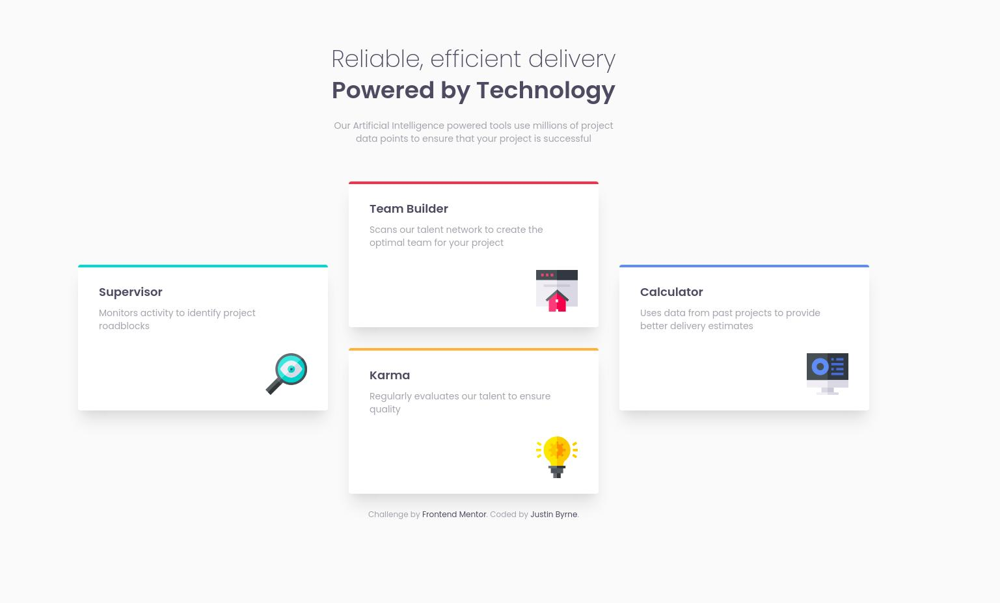

# Frontend Mentor - Four card feature section solution

This is a solution to the [Four card feature section challenge on Frontend Mentor](https://www.frontendmentor.io/challenges/four-card-feature-section-weK1eFYK). Frontend Mentor challenges help you improve your coding skills by building realistic projects. 

## Table of contents

- [Frontend Mentor - Four card feature section solution](#frontend-mentor---four-card-feature-section-solution)
  - [Table of contents](#table-of-contents)
  - [Overview](#overview)
    - [The challenge](#the-challenge)
    - [Screenshot](#screenshot)
    - [Links](#links)
  - [My process](#my-process)
    - [Built with](#built-with)
    - [What I learned](#what-i-learned)
  - [Author](#author)

## Overview

### The challenge

Users should be able to:

- View the optimal layout depending on their device's screen size

### Screenshot



### Links

- Solution URL: [GitHub Repo](https://github.com/JustinByrne/FM-Stats-preview-card-component/)
- Live Site URL: [GitHub Page](https://justinbyrne.github.io/FM-Stats-preview-card-component/)

## My process

### Built with

- Semantic HTML5 markup
- CSS custom properties
- Flexbox
- CSS Grid
- Mobile-first workflow
- [Tailwind CSS](https://tailwindcss.com/) - CSS framework
- [Browser-Sync](https://browsersync.io/) - Browser Hot Reload

### What I learned

As the requirement 

```js
TBC
```

## Author

- Website - [JRLByrne Tech](https://tech.jrlbyrne.com)
- Frontend Mentor - [@JustinByrne](https://www.frontendmentor.io/profile/JustinByrne)
- Twitter - [@JustinBTechGuy](https://www.twitter.com/JustinBTechGuy)

